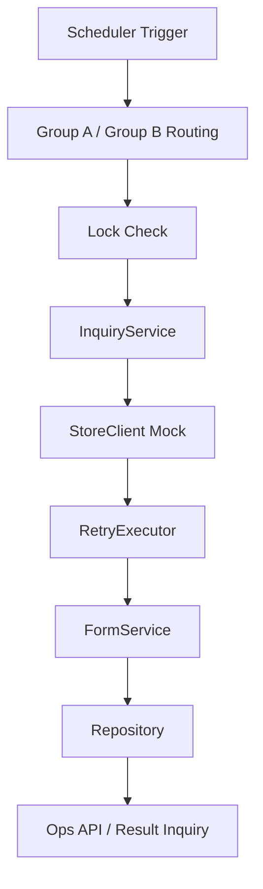

# ops-scheduler-batch-jobs

[](https://github.com/Gseobi/ops-scheduler-batch-jobs/actions/workflows/ci.yml)

스케줄러 기반 배치 작업을 단순 시간 실행 코드가 아니라 **중복 실행 제어, 외부 연동 책임 분리, 재시도, 운영 가시성** 문제로 보고 재구성한 Backend 프로젝트입니다.

실제 운영 환경에서 다뤘던 배치 실행 제어와 후속 점검 구조를 바탕으로, 다중 인스턴스 환경과 외부 연동 실패를 고려한 배치 문제를 **Mock 기반 구조**로 재구성했습니다.

<br/>

## 1. Quick Proof

- **정시 실행 자체보다 실행 제어와 운영 확인 구조를 먼저 설계한 배치 프로젝트입니다.**
- **Group-based scheduling + Lock 구조**로 다중 인스턴스 환경에서의 기본 중복 실행 위험을 줄이는 방향을 보여줍니다.
- **Inquiry / Normalize / Save / Ops API** 책임을 분리해, 실행 이후에도 결과를 확인하고 점검할 수 있도록 구성했습니다.
- **RetryExecutor 기반 재시도 흐름**으로 외부 조회 실패를 메인 배치 흐름과 분리했습니다.

즉, 이 프로젝트는 단순 Scheduler 예제보다 **실행 제어, 실패 대응, 운영 가시성**을 먼저 보여주는 배치 처리 프로젝트입니다.

<br/>

## 2. Execution Evidence

### Verification Summary

| Scenario | Expected Behavior | Result | Evidence |
|---|---|---|---|
| Group-based execution | 서버 그룹별로 실행 시점을 분산 | Pass | `docs/test-report.md` |
| Lock-based execution guard | 중복 또는 겹치는 실행을 기본적으로 제어 | Pass | `docs/test-report.md` |
| Inquiry / Normalize separation | 외부 조회와 내부 정규화 책임 분리 | Pass | `docs/test-report.md` |
| Retry with backoff | 외부 조회 실패 시 재시도 흐름 동작 | Pass | `docs/test-report.md` |
| Ops API verification | 수동 실행 / 최근 결과 조회 / 단건 조회 API 동작 | Pass | `docs/test-report.md` |
| CI regression check | build / test 자동화 기반 기본 회귀 확인 | Pass | GitHub Actions |

### Representative Execution Flow



### Example Execution Log

```text
[Scheduler] Group A trigger started
[Lock] Batch lock acquired
[InquiryService] Target reviews: 42
[StoreClient] External inquiry failed for reviewId=10321 (attempt=1)
[RetryExecutor] Retry scheduled with backoff
[StoreClient] External inquiry success for reviewId=10321 (attempt=2)
[FormService] Review normalized successfully
[Repository] Review saved: reviewId=10321
[Ops API] Latest batch result available
[Lock] Batch lock released
```

### What This Proves

- 배치는 **실행 여부보다 중복 실행 제어와 실패 대응 구조**가 중요합니다.
- 외부 조회 실패를 **retry 가능한 흐름**으로 분리해 운영 안정성을 높였습니다.
- 결과를 API와 로그 기준으로 확인할 수 있게 해 **운영 가시성**을 확보했습니다.

<br/>

## 3. Problem & Design Goal

운영 환경의 배치 작업은 “정해진 시간에 돌아간다”만으로 충분하지 않습니다.

실제로는 아래와 같은 문제가 함께 따라옵니다.

- 다중 인스턴스 환경에서 동일 배치가 동시에 실행될 수 있음
- 외부 시스템 호출 실패가 반복될 수 있음
- 어떤 데이터가 저장되었는지 운영자가 바로 보기 어려움
- 실패 건과 성공 건을 나눠서 추적할 필요가 있음
- 수동 실행이나 후속 점검용 API가 필요할 수 있음

이 프로젝트는 위 문제를 다음 방향으로 풀었습니다.

- **Group-based scheduling**으로 실행 시점 분산
- **Lock 기반 구조**로 기본 중복 실행 제어
- **Inquiry / Normalize / Save** 책임 분리
- **RetryExecutor**로 재시도 흐름 분리
- **Ops API**로 수동 실행 및 결과 확인 지원

핵심은 배치를 단순 시간 트리거가 아니라, **운영자가 통제하고 확인할 수 있는 실행 구조**로 만드는 것입니다.

<br/>

## 4. Key Design Points

### 1) Group-based scheduling으로 실행 시점 분산

이중화 환경에서는 모든 인스턴스가 같은 시각에 같은 작업을 실행하지 않도록 제어하는 것이 중요합니다.

- Group A: 0 / 6 / 12 / 18 시 실행
- Group B: 3 / 9 / 15 / 21 시 실행
- 같은 작업이 같은 시각에 중복 수행될 위험을 줄이는 방향을 보여줍니다.

### 2) 배치 계층 간 책임 분리

배치 코드가 하나의 스케줄 메서드에 몰리면 유지보수와 테스트가 어려워집니다.

- `Scheduler`: 실행 트리거 및 그룹 분기
- `InquiryService`: 대상 반복 처리와 전체 흐름 조정
- `StoreClient`: 외부 조회 책임
- `FormService`: 내부 표준 형식으로 정규화
- `Repository`: 저장 및 조회

핵심은 배치를 하나의 메서드가 아니라 **운영 가능한 흐름**으로 나누는 것입니다.

### 3) Retry와 운영 가시성

외부 연동 실패를 한 번의 실패로만 끝내지 않고, 재시도와 후속 확인까지 포함해 설계했습니다.

- `RetryExecutor` 기반 재시도
- Lock 기반 기본 실행 제어
- 수동 실행 API 제공
- 최근 결과 조회 및 단건 조회 API 제공

즉, 배치 결과가 **보이고 다시 점검 가능해야 한다**는 운영 관점을 반영했습니다.

<br/>

## 5. Architecture / Flow

### Flow Summary

1. Scheduler가 정해진 시간에 실행됩니다.
2. 서버 그룹에 따라 실행 시점이 분산됩니다.
3. Lock 상태를 확인해 중복 실행을 방지합니다.
4. `InquiryService`가 대상 목록을 순회합니다.
5. `StoreClient`가 외부 데이터를 조회합니다. (Mock)
6. `RetryExecutor`가 실패 건에 대해 재시도를 수행합니다.
7. `FormService`가 응답 데이터를 내부 표준 형식으로 정규화합니다.
8. `Repository`가 결과를 저장합니다.
9. 운영 확인 API를 통해 수동 실행 또는 결과 조회를 수행할 수 있습니다.

### Main APIs

- `POST /ops/reviews/fetch`
- `GET /ops/reviews?limit=50`
- `GET /ops/reviews/inquiry?reviewId=...&platform=android|ios`

<br/>

## 6. Tech Stack

- Java 17
- Spring Boot 3.x
- Spring Scheduling
- REST Controller
- Logback
- InMemory Repository
- Mock Client
- Gradle
- GitHub Actions

<br/>

## 7. Exception Handling / Extensibility

### Exception Handling

- **Execution Conflict**
  - 중복 또는 겹치는 실행을 명시적으로 제어해야 함
- **External Inquiry Failure**
  - 외부 실패는 우선 재시도 정책을 거친 뒤 처리
- **Normalization Failure**
  - 불완전한 외부 응답은 저장 전 단계에서 정리 필요
- **Persistence Failure**
  - 저장 실패는 실행 트리거 책임과 분리해서 다뤄야 함
- **Operational Visibility**
  - 실패 역시 운영 확인 API나 로그 기준으로 추적 가능해야 함

### Extensibility

- Redis 또는 DB 기반 distributed lock 적용
- 배치 실행 상태 이력 저장
- 실패 건 재처리 큐 또는 보류 처리 구조 추가
- traceId / executionId 기반 로그 추적 강화
- 운영 metrics / monitoring 연계
- 실제 외부 연동 구현체 확장

핵심은 **배치를 단순히 돌리는 것**이 아니라, 운영 규모가 커져도 **통제 가능한 구조로 유지하는 것**입니다.

<br/>

## 8. Notes / Blog

### Project Docs

- [Design Notes](docs/design-notes.md)
- [Test Report](docs/test-report.md)
- [Troubleshooting Notes](docs/troubleshooting.md)

### Blog

이 프로젝트의 설계 배경과 운영 환경에서의 실행 제어 기준은 아래 글에 정리했습니다.

[이중화 환경에서 Scheduler와 Batch를 어떻게 안전하게 실행할 것인가](https://velog.io/@wsx2386/%EC%9D%B4%EC%A4%91%ED%99%94-%ED%99%98%EA%B2%BD%EC%97%90%EC%84%9C-Scheduler%EC%99%80-Batch%EB%A5%BC-%EC%96%B4%EB%96%BB%EA%B2%8C-%EC%95%88%EC%A0%84%ED%95%98%EA%B2%8C-%EC%8B%A4%ED%96%89%ED%95%A0-%EA%B2%83%EC%9D%B8%EA%B0%80)

Keywords: `Scheduler`, `Batch`, `Distributed Execution`, `Retry Policy`, `Operational Visibility`, `Execution Guard`
