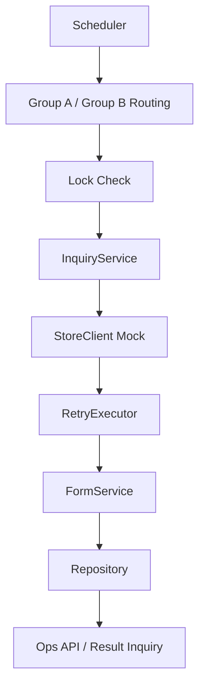

# ops-scheduler-batch-jobs

스케줄러 기반 배치 작업을 단순 시간 실행 코드가 아니라 **중복 실행 제어, 외부 연동 책임 분리, 재시도, 운영 가시성** 문제로 보고 재구성한 Backend 프로젝트입니다.

 

## 1. Overview

이 프로젝트는 운영 환경에서 사용되던 스케줄러 기반 배치 구조를 포트폴리오 형태로 재구성한 프로젝트입니다.

실제 배치 작업에서는 단순히 정해진 시각에 코드를 실행하는 것보다 아래 관점이 더 중요했습니다.

- 이중화 환경에서 중복 실행을 어떻게 줄일 것인가
- 외부 연동 책임을 어디까지 분리할 것인가
- 실패 시 재시도와 후속 점검을 어떻게 구성할 것인가
- 운영자가 결과를 확인할 수 있는 구조를 어떻게 만들 것인가

이 프로젝트는 이러한 문제를 **실행 트리거, 외부 조회, 정규화, 저장, 운영 확인**이라는 책임으로 나눠 설명하는 데 초점을 둡니다.

 

## 2. Problem This Project Solves

운영 환경의 배치 작업은 “정해진 시간에 돌아간다”만으로 충분하지 않습니다.

실제로는 아래와 같은 문제가 함께 따라옵니다.

- 다중 인스턴스 환경에서 동일 배치가 동시에 실행될 수 있음
- 외부 시스템 호출 실패가 반복될 수 있음
- 어떤 데이터가 저장되었는지 운영자가 바로 보기 어려움
- 실패 건과 성공 건을 나눠서 추적할 필요가 있음
- 수동 실행이나 후속 점검용 API가 필요할 수 있음

이 프로젝트는 이러한 문제를 다음과 같이 해결하려고 했습니다.

- 그룹 기반 시간 분산 실행
- Lock 기반 기본 중복 실행 방지
- 외부 조회 책임과 정규화 책임 분리
- RetryExecutor 기반 재시도 흐름 분리
- 운영 확인용 API 제공

즉, 이 프로젝트는 단순 Scheduler 예제가 아니라 **실행 제어와 운영 가시성**을 중심으로 설계한 배치 프로젝트입니다.

 

## 3. Key Design Points

### 1) Group-based distributed scheduling

이중화 환경에서는 모든 인스턴스가 같은 시각에 같은 작업을 실행하지 않도록 제어하는 것이 중요합니다.

이 프로젝트는 그룹별 시간 분산 실행을 적용했습니다.

- Group A: 0 / 6 / 12 / 18 시 실행
- Group B: 3 / 9 / 15 / 21 시 실행

이를 통해 동일 작업이 같은 시점에 중복 수행될 위험을 줄이는 방향을 보여줍니다.

### 2) 배치 계층 간 책임 분리

배치 코드가 하나의 스케줄 메서드에 몰리면 유지보수와 테스트가 어려워집니다.

그래서 아래와 같이 역할을 분리했습니다.

- `Scheduler`: 실행 트리거 및 그룹 분기
- `InquiryService`: 대상 반복 처리와 전체 흐름 조정
- `StoreClient`: 외부 조회 책임
- `FormService`: 내부 표준 형식으로 정규화
- `Repository`: 저장 및 조회

핵심은 “배치를 돈다”가 아니라 **누가 어떤 책임으로 배치를 구성하는가**입니다.

### 3) Retry와 운영 가시성

외부 연동 실패를 한 번의 실패로만 끝내지 않고, 재시도와 후속 확인까지 포함해 설계했습니다.

- `RetryExecutor` 기반 재시도
- Lock 기반 기본 실행 제어
- 수동 실행 API 제공
- 최근 결과 조회 및 단건 조회 API 제공

즉, 배치 결과가 “보이고 다시 점검 가능해야 한다”는 운영 관점을 반영했습니다.

 

## 4. Architecture / Flow

### Flow Summary

1. Scheduler가 정해진 시간에 실행됩니다.
2. 서버 그룹에 따라 실행 시점이 분산됩니다.
3. Lock 상태를 확인해 중복 실행을 방지합니다.
4. `InquiryService`가 대상 목록을 순회합니다.
5. `StoreClient`가 외부 데이터를 조회합니다. (Mock)
6. `FormService`가 응답 데이터를 내부 표준 형식으로 정규화합니다.
7. `Repository`가 결과를 저장합니다.
8. 운영 확인 API를 통해 수동 실행 또는 결과 조회를 수행할 수 있습니다.

### High-Level Flow

### Main APIs

- `POST /ops/reviews/fetch`
- `GET /ops/reviews?limit=50`
- `GET /ops/reviews/inquiry?reviewId=...&platform=android|ios`

 

## 5. Why These Technologies

### Java 17 + Spring Boot

Scheduler, REST API, 테스트를 하나의 구조 안에서 설명하기에 적합했습니다.  
또한 책임 분리와 배치 흐름을 코드 구조로 표현하기에도 무리가 적었습니다.

### Spring Scheduling

실행 트리거 역할을 간결하게 표현할 수 있어 선택했습니다.  
비즈니스 처리 로직과 실행 시점을 분리해 보여주기에도 적절했습니다.

### Lock 구조

다중 인스턴스 환경에서 중복 실행 방지라는 문제를 설명하기 위해 필수적이었습니다.  
포트폴리오에서는 InMemory Lock을 사용했지만, 실제 운영 환경에서는 Redis 또는 DB Lock으로 확장 가능한 방향을 고려했습니다.

### RetryExecutor

재시도 정책을 메인 배치 흐름과 분리하기 위해 사용했습니다.  
실패 처리 기준과 재시도 책임을 섞지 않고 설명하기에 유리했습니다.

### Mock Client

실제 외부 시스템 연동은 인증, 계정, 환경 제약이 크기 때문에 포트폴리오에서는 구조와 책임 분리에 집중할 수 있도록 Mock 기반으로 구성했습니다.

### Tech Stack

- Java 17
- Spring Boot 3.x
- Spring Scheduling
- REST Controller
- Logback
- InMemory Repository
- Mock Client
- Gradle
- GitHub Actions

 

## 6. Test / CI / Exception Handling

### Test Focus

이 프로젝트는 배치 운영 관점의 시나리오를 중심으로 검증합니다.

- 그룹별 시간 분산 실행 구조 확인
- Scheduler → InquiryService 흐름 검증
- 외부 조회와 정규화 책임 분리 확인
- Retry with backoff 흐름 검증
- Lock 기반 중복 실행 방지 흐름 검증
- 수동 실행 / 최근 결과 조회 / 단건 조회 API 검증

### CI

- GitHub Actions 기반 build / test 자동화
- 배치 흐름과 API 동작에 대한 기본 회귀 확인 가능

### Exception Handling

- **Execution Conflict**
  - 중복 또는 겹치는 실행을 명시적으로 제어해야 함
- **External Inquiry Failure**
  - 외부 실패는 우선 재시도 정책을 거친 뒤 처리
- **Normalization Failure**
  - 불완전한 외부 응답은 저장 전 단계에서 정리 필요
- **Persistence Failure**
  - 저장 실패는 실행 트리거 책임과 분리해서 다뤄야 함
- **Operational Visibility**
  - 실패 역시 운영 확인 API나 로그 기준으로 추적 가능해야 함

 

## 7. Extensibility

이 프로젝트는 현재 배치 시나리오를 넘어 다음과 같은 확장을 염두에 두고 설계했습니다.

- Redis 또는 DB 기반 distributed lock 적용
- 배치 실행 상태 이력 저장
- 실패 건 재처리 큐 또는 보류 처리 구조 추가
- traceId 또는 executionId 기반 로그 추적 강화
- 운영 metrics / monitoring 연계
- 실제 외부 연동 구현체 확장

핵심은 배치를 “실행하는 것”이 아니라, **운영 규모가 커져도 통제 가능한 구조를 유지하는 것**입니다.

 

## 8. Blog / Notes

### Project Docs

- [Design Notes](docs/design-notes.md)
- [Test Report](docs/test-report.md)
- [Troubleshooting Notes](docs/troubleshooting.md)
