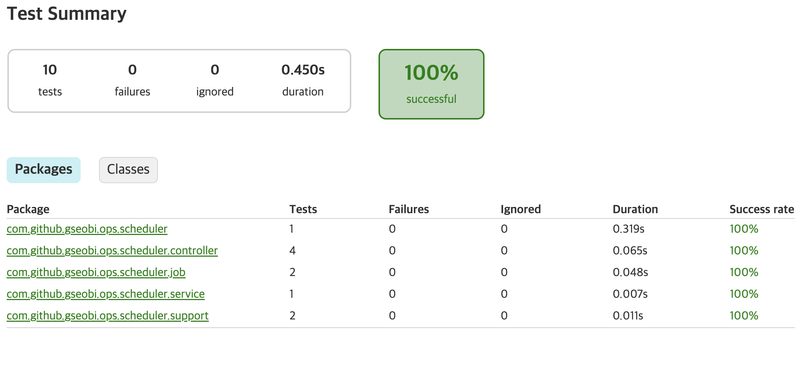
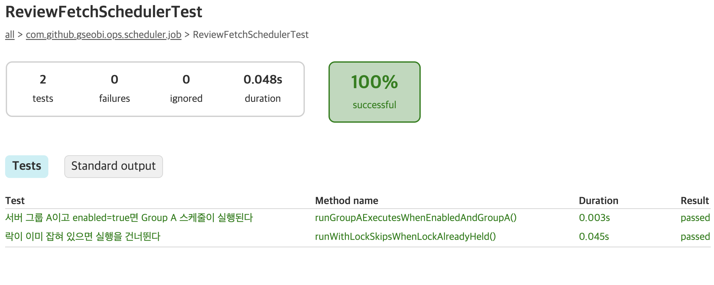
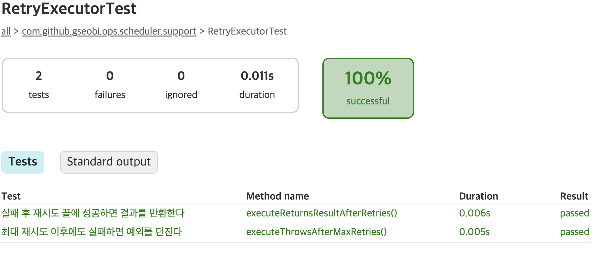
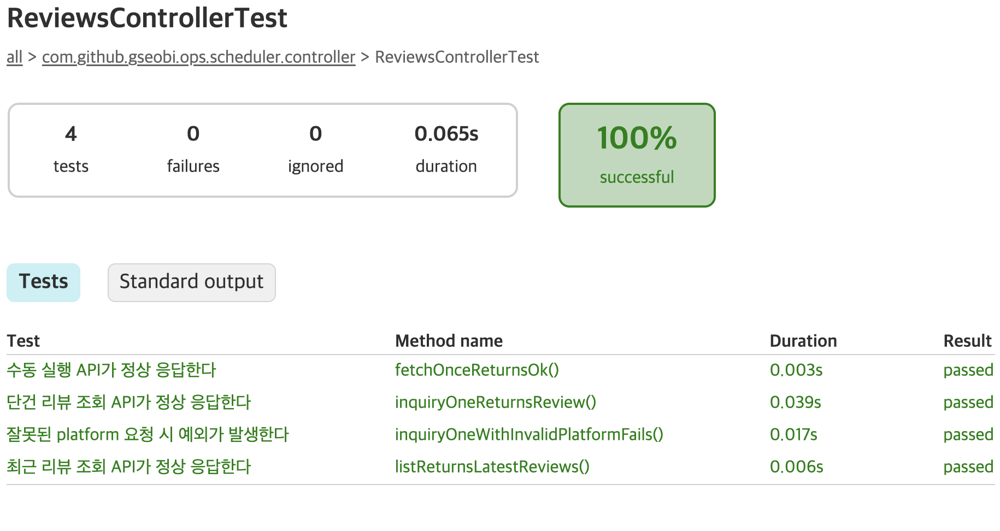
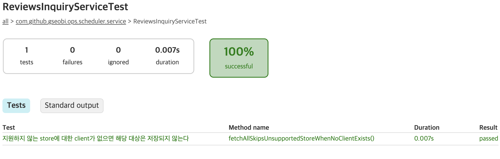
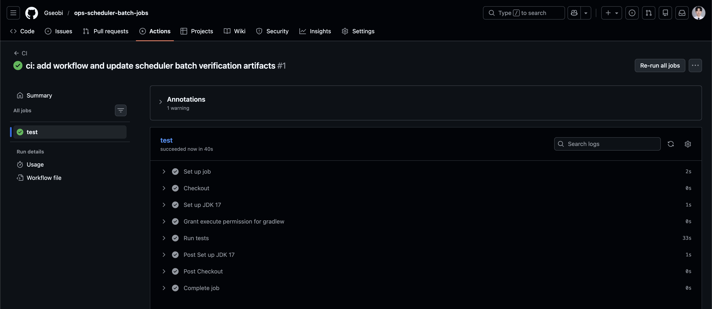

# Test Report

## 1. Overview

본 문서는 `ops-scheduler-batch-jobs` 프로젝트에서 검증한 주요 시나리오를 정리한 문서입니다.

이 프로젝트는 스케줄러 기반 배치 작업에서  
실행 분산, 외부 연동 책임 분리, 재시도, 중복 실행 방지, 운영 확인 가능성을  
어떻게 구조화했는지 보여주는 데 목적이 있습니다.

검증은 아래 두 방향을 기준으로 수행했습니다.

- **자동화 테스트**
  - Spring Boot Test 기반 Controller / Scheduler / Service / Retry 테스트
  - 그룹 분산 실행, 운영 확인 API, 재시도, 중복 실행 방지 흐름 검증
- **구조 검증**
  - Scheduler / InquiryService / StoreClient / FormService / Repository 책임 분리
  - Mock 기반 외부 연동 구조와 InMemory Lock 구조 검증

 

## 2. Test Environment

- Java 17
- Spring Boot 3.x
- Spring Scheduling
- Mock Store Client
- InMemory Repository
- Local Profile
- Gradle Test Report

 

## 3. Automated Test Coverage

### 3.1 Application Context Load
**Test Class**
- `OpsSchedulerApplicationTests`

**Purpose**
- 애플리케이션 컨텍스트가 정상적으로 로딩되는지 확인

**Result**
- Pass

 

### 3.2 Group-based Distributed Scheduling
**Test Class**
- `ReviewFetchSchedulerTest`

**Scenario**
- 서버 그룹 A이고 enabled=true면 Group A 스케줄이 실행된다
- 락이 이미 잡혀 있으면 실행을 건너뛴다

**Expected**
- Group A 조건에서 `fetchAll("SCH-A")` 실행
- Lock이 이미 잡혀 있으면 중복 실행 방지

**Result**
- Pass

 

### 3.3 Retry with Backoff
**Test Class**
- `RetryExecutorTest`

**Scenario**
- 실패 후 재시도 끝에 성공하면 결과 반환
- 최대 재시도 이후에도 실패하면 예외 발생

**Expected**
- 재시도 후 성공 시 정상 결과 반환
- 최대 재시도 이후에도 실패하면 예외 전파

**Result**
- Pass

 

### 3.4 Operational Visibility APIs
**Test Class**
- `ReviewsControllerTest`

**Scenario**
- 수동 실행 API가 정상 응답한다
- 최근 리뷰 조회 API가 정상 응답한다
- 단건 리뷰 조회 API가 정상 응답한다
- 잘못된 platform 요청 시 예외가 발생한다

**Expected**
- `POST /ops/reviews/fetch` 수동 실행 가능
- `GET /ops/reviews?limit=...` 최근 결과 조회 가능
- `GET /ops/reviews/inquiry?...` 단건 조회 가능
- 잘못된 platform 입력은 예외로 처리됨

**Result**
- Pass

 

### 3.5 Inquiry Service Flow
**Test Class**
- `ReviewsInquiryServiceTest`

**Scenario**
- 지원하지 않는 store에 대한 client가 없으면 해당 대상은 저장되지 않는다

**Expected**
- 지원되는 StoreClient만 처리됨
- 미지원 store 대상은 전체 흐름을 중단시키지 않음
- 저장 결과는 지원되는 store 기준으로만 반영됨

**Result**
- Pass

 

## 4. Structural Verification Notes

### 4.1 Responsibility Separation
- `Scheduler` → 실행 트리거 및 그룹 분기
- `InquiryService` → 대상 반복 처리 및 전체 흐름 조정
- `StoreClient` → 외부 시스템 조회 책임
- `FormService` → 내부 표준 형식 정규화
- `Repository` → 결과 저장 및 조회

### 4.2 Execution Control
- 그룹별 시간 분산 실행을 통해 동시 실행 위험 완화
- InMemory Lock 기반 기본 중복 실행 방지 흐름 반영

### 4.3 Operational Visibility
- 수동 실행 API
- 최근 결과 조회 API
- 단건 조회 API

 

## 5. Summary

본 프로젝트에서는 다음 항목을 확인했습니다.

- 그룹별 시간 분산 실행 구조
- Scheduler 기반 배치 실행 흐름
- RetryExecutor 기반 재시도 구조
- Lock 기반 중복 실행 방지 구조
- 운영 확인 API를 통한 결과 가시성
- 지원되는 StoreClient만 처리하는 InquiryService 흐름

이를 통해 `ops-scheduler-batch-jobs`는  
단순한 스케줄러 샘플이 아니라,  
운영 환경에서 중요한 실행 제어와 배치 구조를 고려한 포트폴리오로 동작함을 확인했습니다.

 

## 6. Notes

- 본 프로젝트는 실제 외부 스토어 연동이 아닌 Mock 기반 구조를 기준으로 검증했습니다.
- Lock은 포트폴리오용 InMemory 구조를 사용했습니다.
- 검증 목적은 실제 운영 환경의 완전한 재현보다는 스케줄 실행 제어와 책임 분리 구조를 설명하는 데 있습니다.
- 잘못된 platform 입력은 현재 구현 기준으로 예외를 직접 발생시키는 방식으로 처리합니다.

 

## 7. Test Report Snapshot

### Overall Summary

### Scheduler Test

### Retry Test

### Controller Test

### Inquiry Service Test

## 8. CI Snapshot
